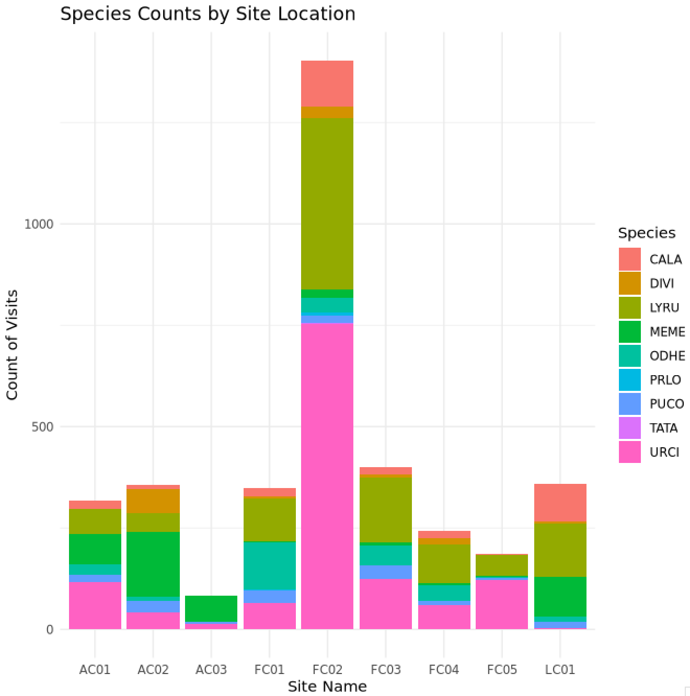
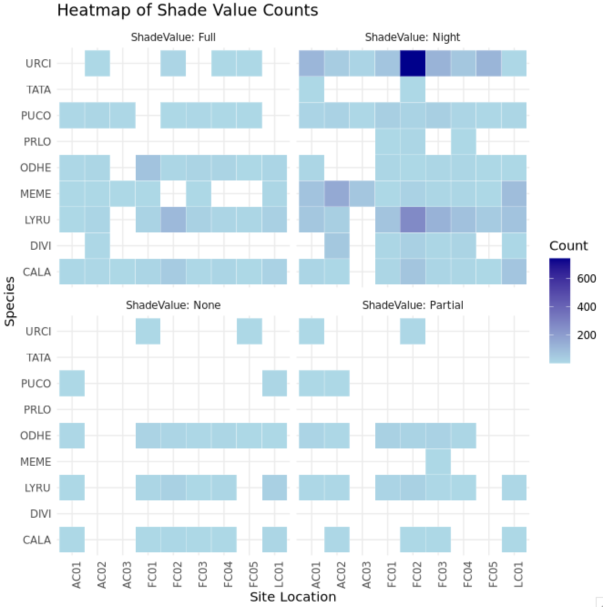
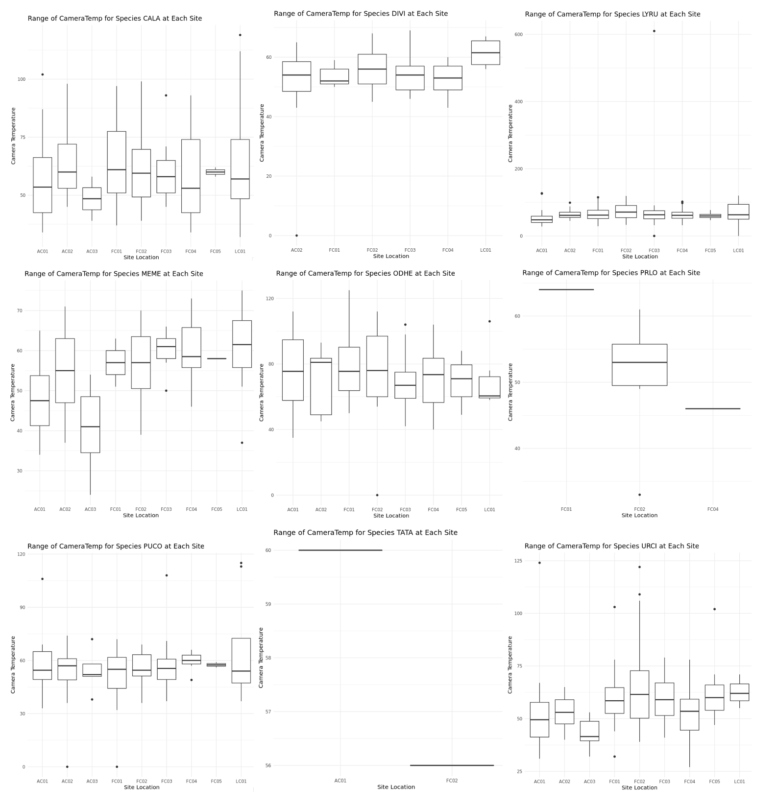
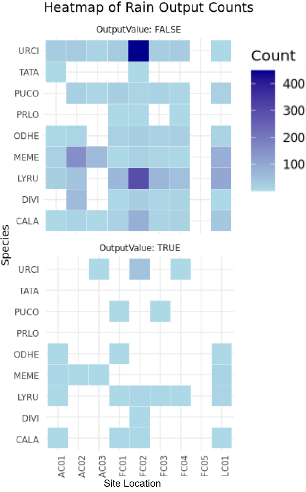

# EE282 Final Project Report

author: Megan Steen

## Introduction
Understanding communities, or the interactions between various species and their environment, is an important topic of ecology because these interactions can potentially influence patterns of natural selection and evolution of a species evolved over time. Each species has their own set of conditions (shelter, food availability, climate, etc.) that they must meet in order to thrive. Because of this, animals will alter their behavior in their interactions with other species and their environment to maximize these conditions and give themselves the best chance at survival.

There are many reasons, caused by both intrinsic and extrinsic factors, that an animal will alter its behavior. Intrinsically, the genetic makeup of an organism alters the phenotype, or physical development of an organism, which can then go on to influence the physical needs of an animal as it interacts with its surroundings (Wcislo, 1989). Thus, behavior and structure of an animal are closely intertwined. While past research has focused on these inherent characteristics, external factors also come into play in behavior alteration. For example, studies have shown that beetles will alter foraging behaviors depending on variances in food availability in an area (McIntyre & Wiens, 1999). In this study, McIntyre and Wiens demonstrate that spatial structure and the arrangement pattern of resources influenced beetles’ movement pathways. Past studies, like the one discussed previously, have focused on the alteration of animal movement and behavior in relation to abiotic factors such as resource distribution, however to the best of my knowledge, no study has focused on the physical aspects of the environment such as variations in terrain, which will be the focus of my study.

The general topic of my research is the effects of landscape on animal movement and behavior. By analyzing the movement of various species in relation to different aspects of their landscape, I aim to determine if different environmental elements have a positive or negative impact on animal behavior. The purpose of this experiment is to use bioinformatics to sort and analyze my data to see if various environmental factors, specifically shade levels, temperature, and climate (in this case the presence or absence of rain) are correlated with animal movement patterns. Additionally, I would like to determine if these environmental factors are correlated with biodiversity in the area, and to cross-compare species data to determine if the presence of various species influence others in the community. In this experiment I will be testing two hypotheses: (1) all species will favor areas with higher shade levels, lower temperatures, and the absence of rain because these factors can influence energy conservation methods and locomotion through an area; and (2) that biodiversity will vary between sites so specific species can avoid competition with each other.

## Methods
### Sorting the Data
The current data set, all of which is extrapolated from motion-activated trail camera videos, consists of around 3800 videos. Across these videos, nine different species are represented (Shown in the following table) across nine different locations in Silverado Canyon in Orange County, California. To eliminate excess data and organize the necessary variables for analysis, sorting the data is key. Gawk commands were used to quickly automate file sorting. To begin, columns that are unnecessary for my analysis were removed from the data file to tidy up the original data set. Next, the data was sorted two times: once by species, and then further by site location. Finally, data points where “NA” was input for any of the values were removed from the file. The code used can be found in the “final_project_sort.sh” file.

| Species Abbreviation | CALA   | DIVI    | LYRU   | MEME          | ODHE      | PRLO    | PUCO          | TATA            | URCI     |
|----------------------|--------|---------|--------|---------------|-----------|---------|---------------|-----------------|----------|
| Common Name          | Coyote | Opossum | Bobcat | Striped Skunk | Mule Deer | Raccoon | Mountain Lion | American Badger | Gray Fox |

### Calculate Site Visitation Frequency
Many calculations need to be made to determine the correlation between different aspects of the landscape and animal behavior patterns. Specifically, the site visitation frequency, or amount of times each species visits a specific site, was used to determine which sites are favored by each species. Gawk commands were used to filter and sort through the data set for data related to species and site location. First, the total number of site visits for each species was determined. Additionally, total site visits for each species/site pairing were calculated. Finally, the information gathered above was used to determine the frequency visitation percent for each species/site pairing.The code used to make these calculations can be found in the “final_project_sitefreq.sh” file.

### Determining the Influence of Environmental Factors on Animal Behavior
For the purposes of this experiment, it is important to note that the variation between different site locations will be used to determine the influence of landscape on animal behavior because the animals will encounter different conditions and terrains in these areas. Thus, to determine the influence of environmental factors, specifically shade coverage, camera temperature (which acts as an extension of surrounding temperature), and climate (in this case, rain), I examined the correlation between these factors and how often they appeared at each site. This was then cross-referenced with the site frequency data to determine if each species visited sites with specific conditions more than others. The code used to run these calculations and create plots for the results can be found in the “final_project_envfactor.sh” file.

## Results
### Site Visitation Frequency
The following figure shows the count of how many times each species visited each site, or in other words, the site visitation frequency.  Site FC02 was the most visited site overall and was favored by every species, Additionally, site AC03 was the least visited site overall, and was only visited by ⅓ of the species that were observed. While most species visited every site, there were a few exceptions. While the species CALA, LYRU, MEME, ODHE, and PUCO primarily visited every site, species such as DIVI, PRLO, and TATA had more scattered results. It is important to note that there were only two total site visits for TATA (to sites AC01 and FC02), so the small value does not make it visible on the plot.

### Shade Coverage
The shade data was subset into four categories: none, partial, full, or night. The following image shows the count for each of the output values per species at each site location. Overall, the preferred level of shade coverage for every species is that of nightfall, while the least preferred level of shade coverage is either partial or no shade. The plot also indicates that URCI had the most visits of spots at nightfall than any other species by a large amount.

### Temperature
Box plots for each species, shown in the figure below, were created to determine the range of temperatures at each site. The plots can also be found at a bigger scale in the file “EE282_Final_Temp_Plots” for better ease of view. For most species/site pairs, the average temperature fell between 50-75 fahrenheit, thus there is no major difference between temperature and location. It is also important to note that there are many high value outliers for each species. This is due to the fact that the recorded temperature is camera temperature, not temperature of surroundings. This data is treating camera temperature as an extension of the surrounding temperature, however the cameras can overheat when left in the direct sunlight which causes these high temperature outliers.

### Presence of Rain
The data collected about the presence of rain in each location was divided into two categories: TRUE if rain was present, and FALSE if rain was absent. A heatmap indicating the count of each output is shown in the figure below. For all the species/site pairings, the absence of rain is the most common outcome. The plot also shows that URCI and LYRU had the most visits to sites where rain is absent compared to other species.

## Discussion
This experiment demonstrates the importance of including environmental factors when considering variables that can influence animal movement and behavior patterns. Because each species has their own unique conditions needed to survive, they are constantly adapting to their environment to be as successful as possible. By better understanding how the environment can influence these patterns, we gain information that can be used to understand communities better and can use this knowledge in future studies or conservation efforts. My experiment aimed to explore two hypotheses: (1) that species would favor specific abiotic conditions because of their influence on energy conservation; and (2) biodiversity will change between sites.

Overall, the site frequency data gave an insightful look into which sites were favored by each species and the overarching biodiversity at each site. Overall, site FC02 was favored by every species, indicated by the large amount of data for this site compared to other sites. In contrast, site AC03 was least favored, indicated by the total number of visits here and the lack of diversity at this site compared to others. This result was the opposite of what was predicted for biodiversity patterns. I believed species diversity would be more spread out between all nine sights to avoid competition, but every species tended to favor the same site. Additionally, site AC03, the site with the least visits, only had visits by three out of nine species (MEME, PUCO, and URCI, which indicates that the other species would rather risk competition at a more popular site in order to have better environmental conditions and resource availability. These three species are a mix of predator and prey species, so further studies would be needed to confirm why these three visited this site when the others did not. 

Additionally, the favorability of specific environmental conditions can be cross-compared with site frequency to determine if species intentionally visited sites with more favorable conditions compared to others. Overall, the shade level of nightfall and the absence of rain had the highest number of outputs for each site, meaning these conditions were preferred over others. For both of these factors, site FC02 had the highest count, meaning that the species favored site FC02 when these conditions were present. In contrast, the counts for these conditions at site AC03 were lower, and matched the counts of the unfavored conditions more closely. It is important to note that while not all the species observed are strictly nocturnal, many are more likely to be active at night which could sway the results of the preferred shade data. Camera temperature, and thus surrounding temperature, was also observed during the experiment. As mentioned previously, most species/site pairings were found to have an average temperature between 50-75 degrees fahrenheit. Overall for this factor there was no strong fluctuation of favoritism between sites. However, for all the species that visited both sites (MEME, PUCO, and URCI) the average temperature at site FC02 was recorded as higher than the temperature at AC03, which again indicates that the species preferred higher temperatures, and therefore preferred site FC02 for providing those conditions. Overall, this indicates that the species do favor a specific site (in this case site FC02) due to the presence of specific environmental conditions

Overall, the hypothesis that different species would favor locations with specific environmental conditions was correct. While there are other factors that could come into play, such as low numbers overall of data points for species like TATA, the data indicates site FC02 was favored due to specific conditions. There are an overwhelming number of aspects to look at when considering an animal and how it interacts with its environment, and to expand further, how this could influence how animals interact with each other in their communities. By beginning to understand just a few of these factors, this study provides important insight into the mechanics of how animal movement and behavior works.

## References
Anick Abourachid. 2003. A new way of analysing symmetrical and asymmetrical gaits in quadrupeds. Comptes Rendus. Biologies 326 no. 7: 625-630.

McIntyre NE, Wiens JA. 1999. Interactions between landscape structure and animal behavior: the roles of heterogeneously distributed resources and food deprivation on movement patterns. Landscape Ecology 14: 437-447.

Wcislo, W. T. 1989. Behavioral environments and evolutionary change. Annual Review of Ecology and Systematics 137-169.

