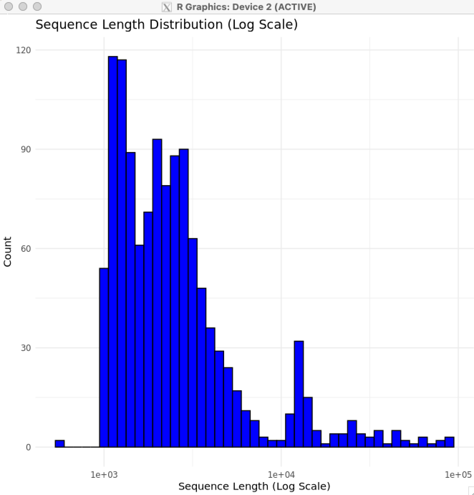
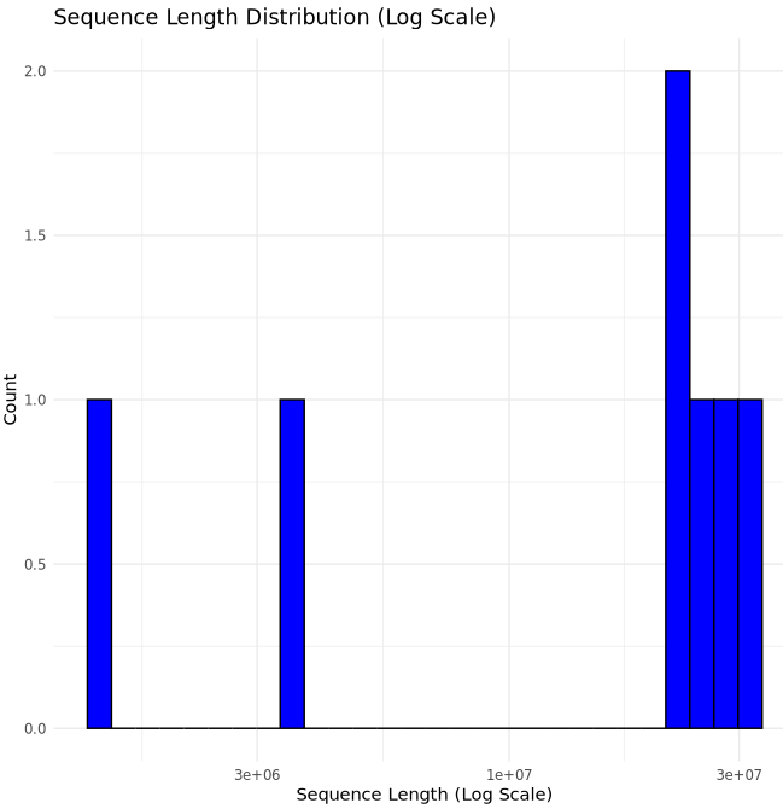
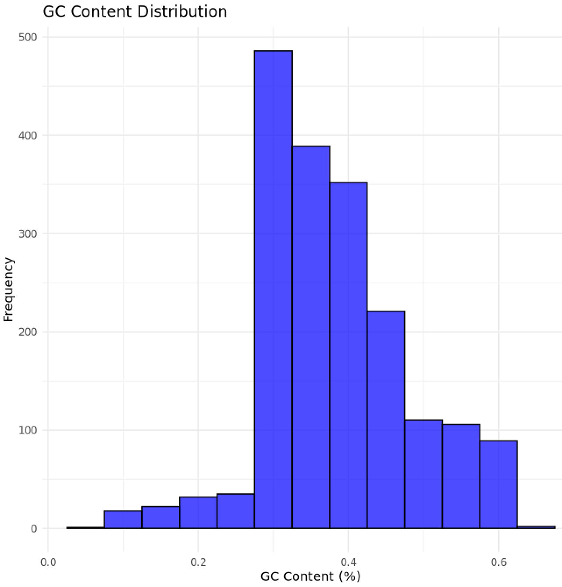
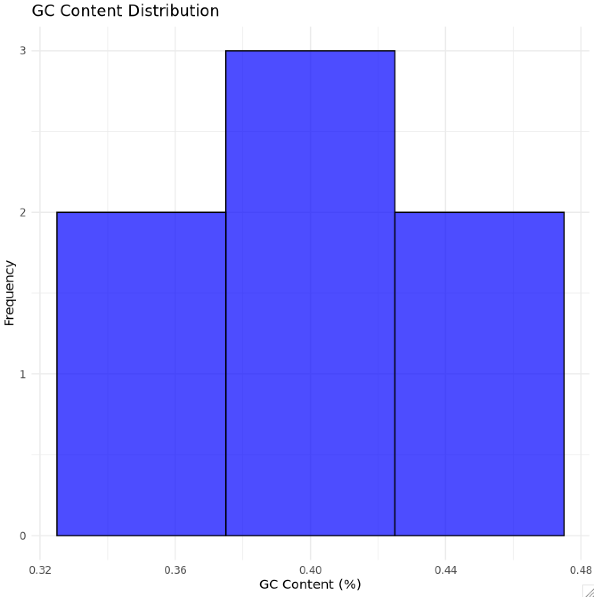
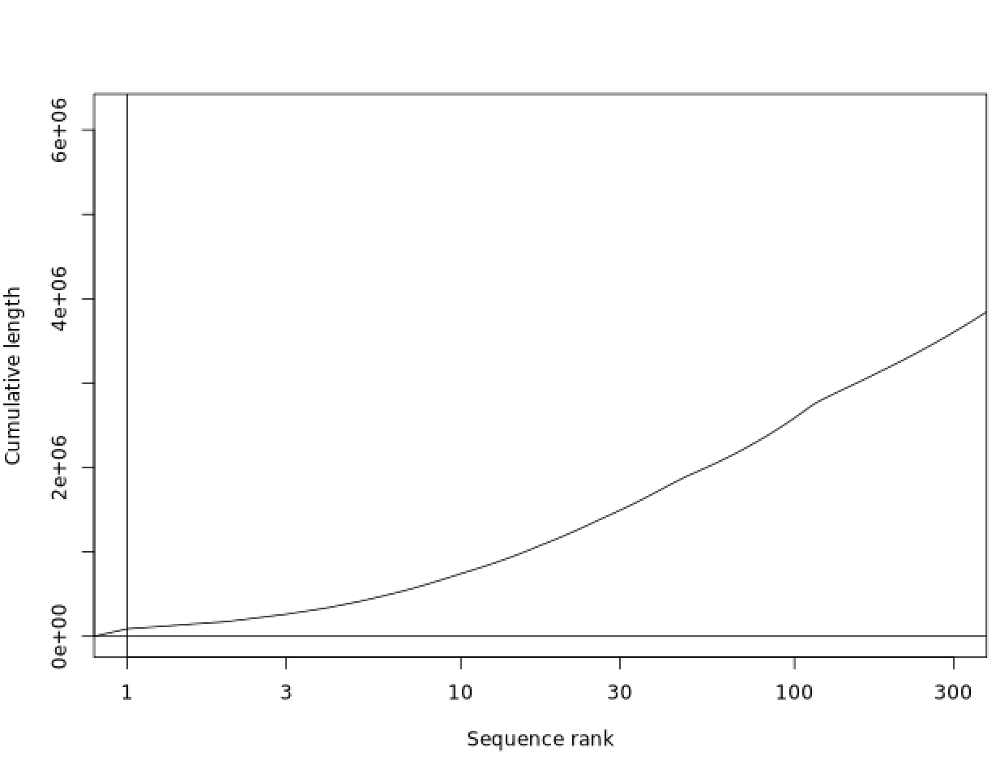
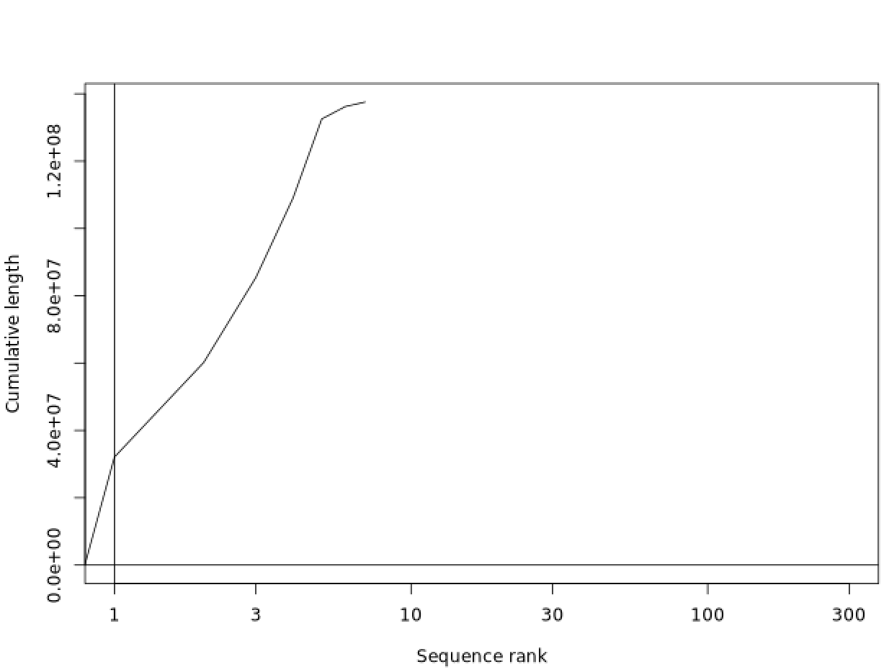
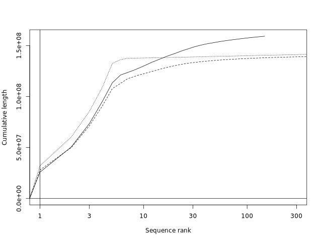
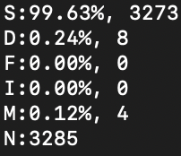

# Homework 4: pipelines, plotting, genome assembly

author: Megan Steen

## Summarize partitions of a genome assembly
A more detialed summary of the code for this portion can be found in the file hw4_genome_summary.sh

### Summary for sequences less than/equal to 100kb

Use ```faFilter -maxSize=100000 dmel-all-chromosome-r6.48.fasta hw4_output_lessequal.fasta``` to partition the data into a file containing all sequences with less than or equal to 100kb.

Next, use ```faSize hw4_output_lessequal.fasta``` to get the genome summary. The results are given below:

1. Total number of nucleotides is 6178042.
2. Total number of Ns is 662593.
3. Total number of sequences is 1863.

### Summary for sequences greater than 100kb

Use ```faFilter -minSize=100001 dmel-all-chromosome-r6.48.fasta hw4_output_greaterto.fasta``` to partition the data into a file containing all sequences with greater than 100 kb.

Next, use ```faSize hw4_output_greaterto.fasta``` to get the genome summary. The results are given below:

1. Total number of nucleotides is 137547960.
2. Total number of Ns is 490385.
3. Total number of sequences is 7.

### Plots for the sequence summaries

#### Sequence Length Distribution Plots
Sequence length distribution plot for sequences less than or equal to 100kb:


Sequence length distribution plot for sequences greater than 100kb:


#### GC% Distribution Plots
GC% Distribution plot for sequences less than or equal to 100kb:


GC% Distribution plot for sequences greater than 100kb:


#### Cumulative Sequece Size (plotCDF):
Cumulative sequence size plot for sequences less than or equal to 100kb:


Cumulative sequence size plot for sequences greater than 100kb:


## Genome Assembly
A more detialed summary of the code for this portion can be found in the file hw4_genome_assembly.sh

### Assembly Assessment
Use ```hifiasm``` to assemble the genome reads. Then, use bioawk to sort and filter the reads.

The assembly was found to have a contig N50 value of 21.7 Mb. This is slightly larger than the _Drosophilia_ community reference value of 21.5 Mb.

### Contiguity Plot
The following contiguity plot was made by comparing the scaffold asse,bly from flybase, the contig assembly from flybase, and the assembly from the hifiasm output:


### compleasm analysis
the tool ```compleasm``` was used to analyze the flybase and hifiasm assemblies. Both assemblies had the same output, shown below:


